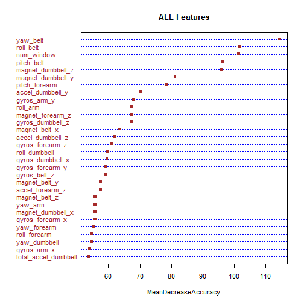

# Executive Summary
Using a random Forest model, we are able to effectively classify a test set of 20 observations. The random forest provides a great and accurate which is basically cross validates itself. We also compared another decision tree using the J48. Both models were pretty accurate and we can make great classificaiton predictions using these supervised learning algorithms.

# The Project Scope
Using data from wear-able devices, we want to  use data from accelerometers on the belt, forearm, arm, and dumbell of 6 participants and classify their actions. They were asked to perform barbell lifts correctly and incorrectly in 5 different ways. 
We want to to treat this problem as a supervised learning problem, since we have historical data, we want to create a classification model then apply it to classify the 20 test cases, provided by Couresa. 
We will go over:
* Prepping the data
* Building the model,
* Specificy how we used cross Validation (CV)
* Discuss the out of sample error rates.

# Pre-Processing and Data Cleaning

## Loading the data

Here is the script to load the data. the Test and training sets have been created for us.

```r
setwd("C:/Users/nwells/Documents/COURSERA/MachineLearningProject")
set.seed(50) # keep it reproducible homies.
train<-read.csv("pml-training.csv",h=T)
test<-read.csv("pml-testing.csv",h=T)
```
Lets see a little bit of the data with str(train) but its a pretty long output.
The bottom line is that we see missing values and NA values in the data.


```r
str(train)
```

We can also see the missing values from the following code.

```r
#see the data and NA's
for (i in 1:ncol(train))
{
print(paste(names(train)[i],sum(is.na(train[,i]))))
}
```
So, now that we kno we have to make some changes - lets do that.
Comments are in the code.

```r
##change the blanks to NA
train[train==""]<-NA
##only keep data with less than 10% blank/NA
newtrain<-train[colSums(is.na(train))/dim(train)[1]<.1]
#remove features with unqiue values
newtrain2<-newtrain[,-c(1:5)]
newtrain2$new_window<-as.numeric(newtrain2$new_window)
datanames<-names(newtrain2[,-55])
#get the test data to match
test2<-test[,datanames]
test2[,1]<-as.numeric((test2[,1]))
```

# Building the Model
We're going to use RWeka to build out model.
why?
It's faster that caret for some functions and its easy.

We're going to make a decision tree using the J48 algorithm.
See can get some good summary results as well.
### J48 Tree

```r
model1<-J48(factor(newtrain2[,55])~.,data=newtrain2[,-55])
summary(model1)
```

```
## 
## === Summary ===
## 
## Correctly Classified Instances       19556               99.6636 %
## Incorrectly Classified Instances        66                0.3364 %
## Kappa statistic                          0.9957
## Mean absolute error                      0.0023
## Root mean squared error                  0.0341
## Relative absolute error                  0.7374 %
## Root relative squared error              8.5875 %
## Coverage of cases (0.95 level)          99.8267 %
## Mean rel. region size (0.95 level)      20.1855 %
## Total Number of Instances            19622     
## 
## === Confusion Matrix ===
## 
##     a    b    c    d    e   <-- classified as
##  5575    4    1    0    0 |    a = A
##     4 3774   10    7    2 |    b = B
##     1   14 3403    4    0 |    c = C
##     0    2    7 3205    2 |    d = D
##     0    1    1    6 3599 |    e = E
```

hmmm - lets see another model.

### Principle Component Analysis

```r
# make everthing numeric and drop that yes no categorical variable
for ( i in 2:(ncol(newtrain2)-1))
{
	newtrain2[,i]<-as.numeric(as.character(newtrain2[,i]))
}
pca1<-prcomp(newtrain2[,-55])

#Get 95% of the variance with the fist 15 PC's
newpcadata<-data.frame(pca1$x[,1:15])
newdata<-cbind(newpcadata,newtrain2[,"classe"])
newdata<-as.data.frame(newdata)

##PCA j48
model2<-J48(factor(newdata[,16])~.,data=newdata[,-16],control = Weka_control(R=T))

summary(model2)
```

```
## 
## === Summary ===
## 
## Correctly Classified Instances       18497               94.2666 %
## Incorrectly Classified Instances      1125                5.7334 %
## Kappa statistic                          0.9275
## Mean absolute error                      0.0341
## Root mean squared error                  0.1416
## Relative absolute error                 10.7832 %
## Root relative squared error             35.6044 %
## Coverage of cases (0.95 level)          97.5538 %
## Mean rel. region size (0.95 level)      25.7507 %
## Total Number of Instances            19622     
## 
## === Confusion Matrix ===
## 
##     a    b    c    d    e   <-- classified as
##  5428   57   36   39   20 |    a = A
##    79 3569   49   52   48 |    b = B
##    57   76 3167   70   52 |    c = C
##    35   54  111 2964   52 |    d = D
##    40   78   33   87 3369 |    e = E
```
Not Great. Here's another.

### Random Forest


```r
library(randomForest)
fsmodel<-randomForest(factor(newtrain2[,55])~.,data=newtrain2[,-55],importance=TRUE,ntree=2000)
varImpPlot(fsmodel,cex = 0.9, pch = 15,color = "brown", lcolor = "blue",bg="black",type=1,main="ALL Features")
```

 

```r
testfs<-importance(fsmodel)
testfs<-as.data.frame(testfs)
fsmodel
```

```
## 
## Call:
##  randomForest(formula = factor(newtrain2[, 55]) ~ ., data = newtrain2[,      -55], importance = TRUE, ntree = 2000) 
##                Type of random forest: classification
##                      Number of trees: 2000
## No. of variables tried at each split: 7
## 
##         OOB estimate of  error rate: 0.15%
## Confusion matrix:
##      A    B    C    D    E  class.error
## A 5579    0    0    0    1 0.0001792115
## B    4 3792    1    0    0 0.0013168291
## C    0    5 3417    0    0 0.0014611338
## D    0    0   13 3202    1 0.0043532338
## E    0    0    0    4 3603 0.0011089548
```

```r
testfs<-testfs[with(testfs, order(-MeanDecreaseAccuracy)), ]
varsal120<-rownames(testfs)[1:20]
```
We can even see the most important variable using the Mean Decrease in accuracy.

# The Cross Validiation

We can use CV to get an idea of how the model will perform.
Here is the CV results from the J48 model. it will average the output.

```r
model1cv<-evaluate_Weka_classifier(model1,numFolds = 10)
model1cv
```

```
## === 10 Fold Cross Validation ===
## 
## === Summary ===
## 
## Correctly Classified Instances       19357               98.6495 %
## Incorrectly Classified Instances       265                1.3505 %
## Kappa statistic                          0.9829
## Mean absolute error                      0.0062
## Root mean squared error                  0.0714
## Relative absolute error                  1.9555 %
## Root relative squared error             17.9455 %
## Coverage of cases (0.95 level)          98.8788 %
## Mean rel. region size (0.95 level)      20.2028 %
## Total Number of Instances            19622     
## 
## === Confusion Matrix ===
## 
##     a    b    c    d    e   <-- classified as
##  5543   26    4    2    5 |    a = A
##    32 3718   25   11   11 |    b = B
##     8   25 3362   20    7 |    c = C
##     2   14   17 3174    9 |    d = D
##     4   14   10   19 3560 |    e = E
```
When using a randomforest we don't really need to CV since the random forest is basically a CV results with a bunch of randomly generated trees.
here are the random Forest results AGAIN!

```r
fsmodel
```

```
## 
## Call:
##  randomForest(formula = factor(newtrain2[, 55]) ~ ., data = newtrain2[,      -55], importance = TRUE, ntree = 2000) 
##                Type of random forest: classification
##                      Number of trees: 2000
## No. of variables tried at each split: 7
## 
##         OOB estimate of  error rate: 0.15%
## Confusion matrix:
##      A    B    C    D    E  class.error
## A 5579    0    0    0    1 0.0001792115
## B    4 3792    1    0    0 0.0013168291
## C    0    5 3417    0    0 0.0014611338
## D    0    0   13 3202    1 0.0043532338
## E    0    0    0    4 3603 0.0011089548
```

# Out of Sample Error
We'd expect the out of sample error to be close if not higher than the cv error since the cv algo divides the data into 10 partitions and predicts 1 of the 10 using the other 9 partitions.
BUT we can create a test and train partition FROM the entire training data set. If we apply it to the test set from the training set we should get an idea of the out of sample error.


```r
library(caret)
inTrain <- createDataPartition(y = newtrain2[,55], p = .6, list = FALSE)
training <- newtrain2[ inTrain,]
testing <- newtrain2[-inTrain,]
model2<-J48(factor(training[,55])~.,data=training[,-55])
oosresults<-predict(model2,newdata=testing[,-55])
confusionMatrix(oosresults,testing[,55])
```

```
## Confusion Matrix and Statistics
## 
##           Reference
## Prediction    A    B    C    D    E
##          A 2203   22    5    5    5
##          B   14 1450   17    8    9
##          C    8   29 1322   33    7
##          D    5   12   23 1220   10
##          E    2    5    1   20 1411
## 
## Overall Statistics
##                                           
##                Accuracy : 0.9694          
##                  95% CI : (0.9654, 0.9731)
##     No Information Rate : 0.2845          
##     P-Value [Acc > NIR] : < 2e-16         
##                                           
##                   Kappa : 0.9613          
##  Mcnemar's Test P-Value : 0.04786         
## 
## Statistics by Class:
## 
##                      Class: A Class: B Class: C Class: D Class: E
## Sensitivity            0.9870   0.9552   0.9664   0.9487   0.9785
## Specificity            0.9934   0.9924   0.9881   0.9924   0.9956
## Pos Pred Value         0.9835   0.9680   0.9450   0.9606   0.9805
## Neg Pred Value         0.9948   0.9893   0.9929   0.9900   0.9952
## Prevalence             0.2845   0.1935   0.1744   0.1639   0.1838
## Detection Rate         0.2808   0.1848   0.1685   0.1555   0.1798
## Detection Prevalence   0.2855   0.1909   0.1783   0.1619   0.1834
## Balanced Accuracy      0.9902   0.9738   0.9772   0.9705   0.9871
```
Thats Pretty low(~2% or 98% accuracy)....we should be good if we made a prediction on the testset.
Here is the random Forest results


```r
fsmodeloos<-randomForest(factor(training[,55])~.,data=training[,-55],importance=TRUE,ntree=2000)
oosresults<-predict(fsmodeloos,newdata=testing[,-55])
confusionMatrix(oosresults,testing[,55])
```

```
## Confusion Matrix and Statistics
## 
##           Reference
## Prediction    A    B    C    D    E
##          A 2232    5    0    0    0
##          B    0 1510    3    0    0
##          C    0    3 1365   11    0
##          D    0    0    0 1272    4
##          E    0    0    0    3 1438
## 
## Overall Statistics
##                                           
##                Accuracy : 0.9963          
##                  95% CI : (0.9947, 0.9975)
##     No Information Rate : 0.2845          
##     P-Value [Acc > NIR] : < 2.2e-16       
##                                           
##                   Kappa : 0.9953          
##  Mcnemar's Test P-Value : NA              
## 
## Statistics by Class:
## 
##                      Class: A Class: B Class: C Class: D Class: E
## Sensitivity            1.0000   0.9947   0.9978   0.9891   0.9972
## Specificity            0.9991   0.9995   0.9978   0.9994   0.9995
## Pos Pred Value         0.9978   0.9980   0.9898   0.9969   0.9979
## Neg Pred Value         1.0000   0.9987   0.9995   0.9979   0.9994
## Prevalence             0.2845   0.1935   0.1744   0.1639   0.1838
## Detection Rate         0.2845   0.1925   0.1740   0.1621   0.1833
## Detection Prevalence   0.2851   0.1928   0.1758   0.1626   0.1837
## Balanced Accuracy      0.9996   0.9971   0.9978   0.9943   0.9984
```
Nice. less than 1%!!! lets use it.

# Deployment and Final Results

Results for the Test Set using the J48

```r
results<-predict(model1,newdata=test2)
table(test$problem_id,results)
```

```
##     results
##      A B C D E
##   1  0 1 0 0 0
##   2  1 0 0 0 0
##   3  0 1 0 0 0
##   4  1 0 0 0 0
##   5  1 0 0 0 0
##   6  0 0 0 0 1
##   7  0 0 0 1 0
##   8  0 1 0 0 0
##   9  1 0 0 0 0
##   10 1 0 0 0 0
##   11 0 1 0 0 0
##   12 0 0 1 0 0
##   13 0 1 0 0 0
##   14 1 0 0 0 0
##   15 0 0 0 0 1
##   16 0 0 0 0 1
##   17 1 0 0 0 0
##   18 0 1 0 0 0
##   19 0 1 0 0 0
##   20 0 1 0 0 0
```
Results of test set Random Forest

```r
predRF<-predict(fsmodel,newdata=test2)
table(test$problem_id,predRF)
```

```
##     predRF
##      A B C D E
##   1  0 1 0 0 0
##   2  1 0 0 0 0
##   3  0 1 0 0 0
##   4  1 0 0 0 0
##   5  1 0 0 0 0
##   6  0 0 0 0 1
##   7  0 0 0 1 0
##   8  0 1 0 0 0
##   9  1 0 0 0 0
##   10 1 0 0 0 0
##   11 0 1 0 0 0
##   12 0 0 1 0 0
##   13 0 1 0 0 0
##   14 1 0 0 0 0
##   15 0 0 0 0 1
##   16 0 0 0 0 1
##   17 1 0 0 0 0
##   18 0 1 0 0 0
##   19 0 1 0 0 0
##   20 0 1 0 0 0
```
I'm submitting the Random Forest Results. why? I like Random Forests.

```r
pml_write_files = function(x){
  n = length(x)
  for(i in 1:n){
    filename = paste0("problem_id_",i,".txt")
    write.table(x[i],file=filename,quote=FALSE,row.names=FALSE,col.names=FALSE)
  }
}

pml_write_files(predRF)
predRF
```

```
##  1  2  3  4  5  6  7  8  9 10 11 12 13 14 15 16 17 18 19 20 
##  B  A  B  A  A  E  D  B  A  A  B  C  B  A  E  E  A  B  B  B 
## Levels: A B C D E
```

what do you know, 100%.
